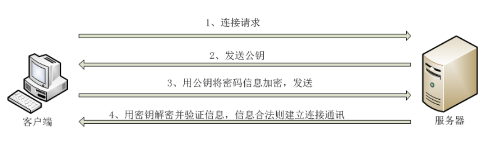
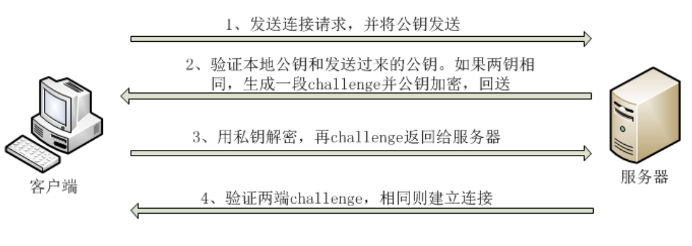
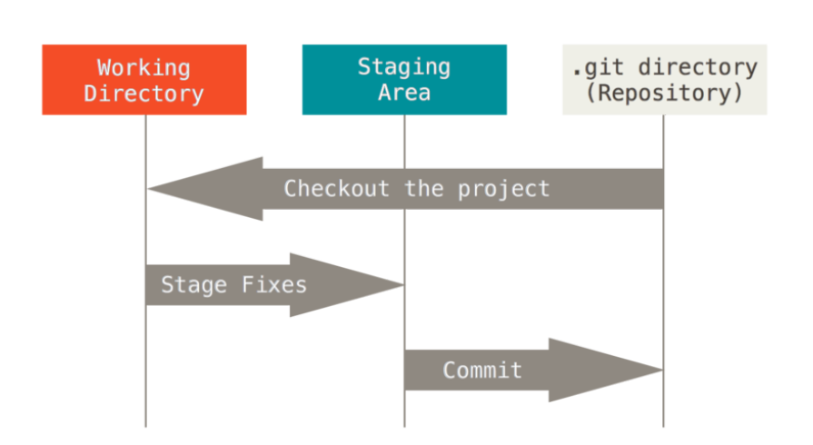
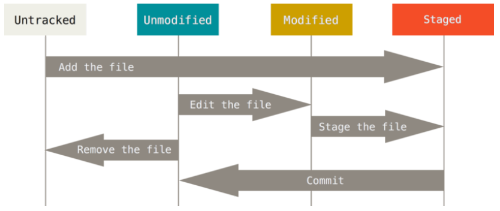

# GIT学习笔记
> github和git工具的学习-读Github入门实践有感

## 1. Github会带来哪些变化
---
### 1.1 Git和Github的区别

### 1.2 GitHub的issue中描述方法
- **@用户名**  
- @组织名  
- @组织名/团队  
- **\# Issue编号**  
- 用户名/仓库名\#编号  
### 1.3 GitHub主要功能
+ **Git仓库**  
    可以免费建立一个GitHub提供的Git仓库。
+ **Organization**  
    是以交流群或IT 小团体的形式进行软件开发。
+ **Issue**  
     &nbsp; &nbsp;是将一个任务或问题分配给一个Issue 进行追踪和管理的功能
    可以像BUG 管理系统或TiDD（Ticket-driven Development）的
    Ticket 一样使用。
+ **Wiki**  
    文档。
+ **Pull Request**  
    &nbsp; &nbsp;开发者向GitHub 的仓库推送更改或功能添加后，可以通过Pull
    Request 功能向别人的仓库提出申请，请求对方合并。
     &nbsp; &nbsp;Pull Request 送出后，目标仓库的管理者等人将能够查看Pull
    Request 的内容及其中包含的代码更改。

## 2. Git的导入
### 2.3 安装
&nbsp;&nbsp;Mac和Linux系统的中的换行是LF(Line Feed)
&nbsp;&nbsp;Windows中的换行是CRLF(Carriage Return + Line Feed)

### 2.4 初始设置
设置Git的<u>姓名</u>和<u>邮箱地址</u>，相关的配置文件在"~/.gitconfig"目录下。
```
$ git config --global user.name "Firstname Lastname"
$ git config --global user.email "your_example@example.com"
```
## 3. Git准备
### 3.1 SSH两种登陆方式
**口令登陆方式:**
 当第一次链接远程主机时，会提示您当前主机的”公钥指纹”，询问您是否继续，如果选择继续后就可以输入密码进行登录了，当远程的主机接受以后，该台服务器的公钥就会保存"~/.ssh/known_hosts"文件中。

**密钥的免密登陆:**
这种验证的前提是客户端需要生成一对密钥，将公钥放到需访问的远程服务器。这种验证比上一种的好处是，不能仿冒真正的服务器，因为要仿冒必须拿到客户端生成的公钥。缺点就是验证等待过程稍长些。

验证过程：
1.在A上生成公钥私钥。 
2.将公钥拷贝给server B，要重命名成authorized_keys(从英文名就知道含义了) 
3.Server A向Server B发送一个连接请求。 
4.Server B得到Server A的信息后，在authorized_key中查找，如果有相应的用户名和IP，则随机生成一个字符串，并用Server A的公钥加密，发送给Server A。 
5.Server A得到Server B发来的消息后，使用私钥进行解密，然后将解密后的字符串发送给Server B。Server B进行和生成的对比，如果一致，则允许免登录。 
总之：A要免密码登录到B，B首先要拥有A的公钥，然后B要做一次加密验证。对于非对称加密，公钥加密的密文不能公钥解开，只能私钥解开。
## 4. Git命令学习
+ 初始化仓库  
`git init`
+ 查看仓库的状态  
`git status`
+ 向暂存区中添加文件  
`git add .`  
`git add README.md`
+ 把暂存区的内容保存到仓库的历史记录中  
`git commit -m "first commit"`
+ 以上两个命令可以一起使用（直接跳过暂存区）  
`git commit -am "first commit"`
+ 查看提交日志(只能查看到当前头的提交日志)  
`git log`  
`git log --pretty=short`  
`git log README.md`  
+ 显示文件的改动  
`git log -p README.md`  
+ 以图标的形式查看分支  
`git log --graph`  
+ 查看更改前后的差别  
`git diff`  
+ 查看工作树和最新提交的差别  
`git diff HEAD`  
+ 显示分支一览表，*表示当前分支  
`git branch`  
+ 创建一个新的分支  
`git branch dev_branch`  
+ 切换分支  
`git checkout master`  
+ 创建一个新的分支并切换  
`git checkout -b dev_branch` 
+ 把指定分支和当前分支合并  
`git merge --no-ff dev_branch` 
+ 回溯历史版本，到指定位置  
`git reset --hard fd0cbf0d4a`  
+ 查看执行过的操作日志  
`git reflog`  
+ 压缩历史，选定当前分支中包含HEAD的最新两个历史对对象   
`git rebase -i HEAD~2`  
+ 添加远程仓库  
`git remote add origin git@github.com:woainirjy/note.git`  
+ 推送到远程仓库，-u表示推送的同时将origin仓库的master仓库设置为本地当前分支的upstream  
`git push -u origin master`  
+ 创建本地和远程分支的上下游关系  
`git branch --set-upstream my_branch origin/my_branch`  
+ 推送到master以外的分支  
`git push -u origin feature-d`  
+ 获取远程仓库  
`git clone git@github.com:woainirjy/note.git`  
+ 查看本地与远程仓库的分支消息  
`git branch -a`  
+ 查看远程仓库地址  
`git remote -v`  
+ 获取远程的指定分支至本地仓库  
`git checkout -b feature-d origin/feature-d`  
+ 获取最新的远程仓库分支  
`git pull origin feature-d`  
+ pull命令详解  
`git pull <远程主机名> <远程分支名>:<本地分支名>`  
`git pull origin master:master`  
+ 远程分支要和当前分支合并冒号后面可以省略  
`git pull origin master`
+ pull和fetch的区别，一句pull命令等效下面两条命令，fetch从远程获取最新版本到本地，不会自动合并  
`git fetch origin`  
`git merge origin/next`  
+ 列出标签  
`git tag`  
`git tag -l 'v1.8.5*'`  
+ 附注标签  
`git tag -a v1.4 -m 'my version 1.4'`  
`git show v1.4`  
+ 轻量标签  
`git tag v1.4`  
+ 后前打标签  
`git tag -a v1.2 9fceb02`  
+ 推送标签到远程服务器  
`git push origin v1.5`  
+ 推送所有的标签  
`git push origin --tags`  
+ 移除文件，从暂存区中移除  
`git rm README.md`  
## 5. Thinking in Git  
**Git 有三种状态**，你的文件可能处于其中之一：**已提交（committed）**、**已修改（modified）**和**已暂存（staged）**。已提交表示数据已经安全的保存在本地数据库中。已修改表示修改了文件，但还没保存到数据库中。已暂存表示对一个已修改文件的当前版本做了标记，使之包含在下次提交的快照中。  
由此引入了Git中的三个工作区：Git仓库，工作目录，暂存区。



文件的生命周期：  
