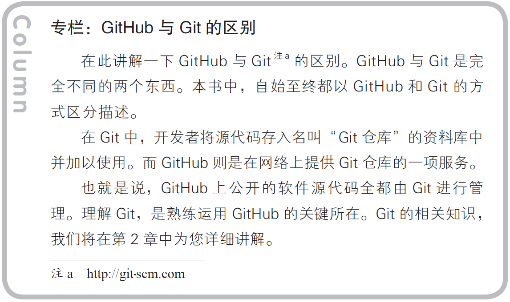

# GIT学习笔记
> github和git工具的学习-读Github入门实践有感

## 1. Github会带来哪些变化
---
### 1.1 Git和Github的区别

### 1.2 GitHub的issue中描述方法
- **@用户名**  
- @组织名  
- @组织名/团队  
- **\# Issue编号**  
- 用户名/仓库名\#编号  
### 1.3 GitHub主要功能
+ **Git仓库**
    vvvvccguceehtuurbujnnhchfkevtnijrjbrrdvriltj
    可以免费建立一个GitHub提供的Git仓库。
+ **Organization**
    是以交流群或IT 小团体的形式进行软件开发。
+ **Issue**
     &nbsp; &nbsp;是将一个任务或问题分配给一个Issue 进行追踪和管理的功能
    可以像BUG 管理系统或TiDD（Ticket-driven Development）的
    Ticket 一样使用。
+ **Wiki**
    文档。
+ **Pull Request**
    &nbsp; &nbsp;开发者向GitHub 的仓库推送更改或功能添加后，可以通过Pull
    Request 功能向别人的仓库提出申请，请求对方合并。
     &nbsp; &nbsp;Pull Request 送出后，目标仓库的管理者等人将能够查看Pull
    Request 的内容及其中包含的代码更改。

## 2. Git的导入
